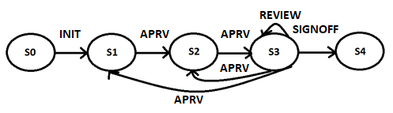

# Motivation and High-Level Design

| [Home](../README.md) |
------------------------

## Blockchain
1.	__Blockchain Benefits__ - It is important to understand why we would use a blockchain in such a solution. Here the key benefits are:
    * Transparency
    * Auditability

    Blockchain applications are ideal for auditing purposes as all operations are signed and immutably recorded.

1. __Cost__ - Interacting with public blockchains costs money. Every operation incurs the payment of a fee. Thus one must balance out the benefit of such an application against its on-going cost.

1. __Data Storage__ - The document review workflow is implemented through Smart Contracts. However, the blockchain only stores metadata, not the documents themselves. Content is stored within some other secure server, whilst a hash is stored on-chain. Details concerning document formatting, uploading/downloading of files are beyond the scope of this project.

 

---

## High-Level Design

The above illustration shows the high-level design of the document review workflow solution. The components included in this repository are highlighted in orange.

__Crypto Exchange__ - An exchange from which crypto currencies are purchased. An admin purchases the native blockchain currency (ETH) and redistributes it to workflow participants. 

__Blockchain__ - The Ethereum public blockchain or some other EVM compatible blockchain.

__File Storage__ - A secure, remotely accessible document storage. 

__UI__ - Interface for users to run the workflow. This can be further broken down into:
* __Device Specific UI__
* __File Storage API__ - An API abstracting file storage
* __Wallet API__ - A minimal wallet for receiving crypto currencies and to pay for transactions.
* __Workflow API__ - A C# library wrapping the smart contracts and providing an additional layer of abstraction.

 

---

## Main Design Elements
This project involves a set of documents that move together through a workflow. In all we have 3 basic ingredients:  
__Document__ - Document content and meta-data.  
__Document Set__ - A set of documents that move together as a unit.  
__Workflow__ - The set of rules governing the review process.

 

### Document
__Name__ - a format and version independent name.

__Version__ - a number that increments with every update.

__Type__ - a number identifying the specific doc type. Doc types are application specific. Here are some unlikely doc type examples:
* Grocery List
* Birthday Gifts List
* Training Plan

Note: The allowed set of types is defined by the __Document Set__.

Note: The type is especially useful on applying business logic rules. Such as whether we want a document to be finally published.

__State__ - a number identifying the document state within the workflow, for example:
* Draft
* Approved
* Reviewed
* Final

__Content__ - the actual document content.

Note: The document content is not stored on-chain, only a hash is saved. 

__Access List__ - a list of individuals/entities together with their workflow access rights. For a given document the set of permissions depends on the document __State__. Each access list entry is granted rights from:

* __Initialize__ - The right to start a new workflow by submitting the initial document versions.
* __Review__ - The right to update/replace documents with a new version.
* __Approve__ - The right to sign a document for it to move to the next stage.
* __Sign-Off__ - The right to conclude the review process classifying the documents as final.
* __Abort__ - The right to terminate a workflow leaving it incomplete.

 

### Document Set
The document set is defined as a list of document types that will move together through the workflow. In terms of properties each may be represented in terms of:

__Type__ - a number identifying the specific doc type (same as in __Document__ | __Type__ above)

__Required__ - a flag identifying whether the document is required or optional. 

__Public__ - a flag identifying whether the document is intended for public consumption or internal use.

 

### Workflow
We define a workflow as a set of __States__ interconnected by __Edges__. An __Edge__ defines the operation that causes documents to move across __States__.
* A Workflow stores a set of States.
* A State stores a set of outgoing Edges.

Edge traversal is triggered by workflow participant actions. Thus, we define an edge as a set of properties that include:

__Address__ - A unique identity representing an entity/person participating in the workflow.

__Action__ - Type of action that the entity/person may perform. The set of actions available maps exactly to the set of rights defined under __Document__ | __Access List__. 

__End-State__ - The State to which the workflow would move on performing __Action__.

The same address might appear multiple times in the list of edges, as one might be allowed to perform different actions.

 

