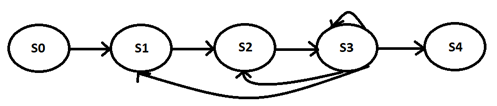
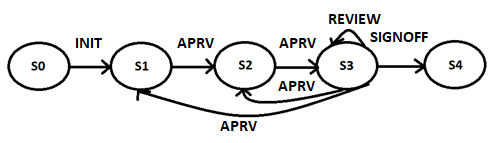

# Creating a Workflow – WorkflowBuilder Contract

``WorkflowBuilder`` allows us to create a workflow state engine definition. It does not concern itself with any business logic. It is like a dumb data structure whose rules must be enforced by some other contract.

The metadata is made up of:
1. A static data structure that defines states and edges.
1. A set of rights that may be edited at run-time. This allows the admin to add remove workflow participants at runtime.

 

## Creating a Workflow Definition

Here are the steps for creating a workflow through calls against the ``WorkflowBuilder`` Contract.

1. Draw the workflow identifying all the states and edges (transitions):

    

1. For each state identify the set of connected states and call the ``WorkflowBuilder`` as shown. The order of these calls is important, as each appends a new state:

    <table class="tg">
    <thead>
    <tr>
        <th class="tg-ri3q">    Initial State   </th>
        <th class="tg-ri3q" colspan="4">    Connected States   </th>
        <th class="tg-ri3q">    WorkflowBuilder   </th>
    </tr>
    </thead>
    <tbody>
    <tr>
        <td class="tg-0pky">        </td>
        <td class="tg-0pky">    E0   </td>
        <td class="tg-0pky">    E1   </td>
        <td class="tg-0pky">    E2   </td>
        <td class="tg-0pky">    E3   </td>
        <td class="tg-0pky">        </td>
    </tr>
    <tr>
        <td class="tg-0pky">    S0   </td>
        <td class="tg-0pky">    S1   </td>
        <td class="tg-0pky">        </td>
        <td class="tg-0pky">        </td>
        <td class="tg-0pky">        </td>
        <td class="tg-0pky">    <code>addState([1])</code>   </td>
    </tr>
    <tr>
        <td class="tg-0pky">    S1   </td>
        <td class="tg-0pky">    S2   </td>
        <td class="tg-0pky">        </td>
        <td class="tg-0pky">        </td>
        <td class="tg-0pky">        </td>
        <td class="tg-0pky">    <code>addState([2])</code>  </td>
    </tr>
    <tr>
        <td class="tg-0pky">    S2   </td>
        <td class="tg-0pky">    S3   </td>
        <td class="tg-0pky">        </td>
        <td class="tg-0pky">        </td>
        <td class="tg-0pky">        </td>
        <td class="tg-0pky">    <code>addState([3])</code>  </td>
    </tr>
    <tr>
        <td class="tg-0pky">    S3   </td>
        <td class="tg-0pky">    S1   </td>
        <td class="tg-0pky">    S2   </td>
        <td class="tg-0pky">    S3   </td>
        <td class="tg-0pky">    S4   </td>
        <td class="tg-0pky">    <code>addState([1,2,3,4])</code>   </td>
    </tr>
    <tr>
        <td class="tg-0pky">    S4   </td>
        <td class="tg-0pky">        </td>
        <td class="tg-0pky">        </td>
        <td class="tg-0pky">        </td>
        <td class="tg-0pky">        </td>
        <td class="tg-0pky">    <code>addState([])</code>   </td>
    </tr>
    </tbody>
    </table>

	This data is stored as an array of arrays:  
	``uint32[][] public states;``
    
    Such that:  
    ``states[InitialState][EdgeIdx] = NextState``

    Each edge may now be identified using (``InitialState``, ``EdgeIdx``) pair. 

    For the first 3 states we only have one edge so we would reference these as (0,0), (1,0) and (2,0). The fourth state has 4 edges (3,0), (3,1), (3,2) and (3,3). The fifth state has none.

1. Lock the State Engine as final with a call to:  
``doFinalize()``

1. Configure a list of user rights for each of these edges, where each list entry is made up of:  
``address:WFRights``

    This is what a workflow, complete with rights, could look like:

        

    Here for clarity we are just showing ``WFRights`` values. However, each is a list of pairs. Such that multiple participants could perform the same actions for a given edge.

    Each list entry should be read as follows:  
    ``address`` is allowed to cause a state transition when performing the operation allowed by ``WFRights``. 

    To add rights use:  
    ``addRight(uint32 stateid, uint32 edgeid, address user, WFRights right)``

    To revoke rights use:  
    ``removeRight(uint32 stateid, uint32 edgeid, address user, WFRights right)``

    Notes:
    <ol type="a">
    <li>
    
In general, it is expected that for each edge you would have at least 1 right assignment configured. But this is not enforced by <code>WorkflowBuilder</code>. Having no entries means that such an edge cannot be traversed. <b>We could add a compile function to enforce this.</b>

    </li>

    <li>
    
Rights are stored as a mapping:  
    <code>mapping(uint256 => uint256[]) public rights;</code>

    
...where   
    Key = &lt;initial state&gt;&lt;edge index&gt;  
    Value = Array of Rights made up of &lt;right&gt;&lt;address&gt; values

    </li>

    <li>
    
<code>removeRight</code> gas consumption is a function of the array length. This is only acceptable if working with short arrays.

    </li>

    <li>
    
<code>WorkflowBuilder</code> enforces these validation rules over rights:

    <table class="tg">
    <tbody>
    <tr>
        <td class="tg-0pky">INIT</td>
        <td class="tg-0pky">
        <ul> 
        <li>Can only be applied to an edge that connects from State0</li>
        <li>Must cause a state transition. </li>
        </ul> 
        </td>
    </tr>
    <tr>
        <td class="tg-0pky">APPROVE</td>
        <td class="tg-0pky">   
        <ul> 
        <li>Cannot connect from State0</li>   
        <li>Must cause a state transition.</li>   
        <li>Must not end in an end-state (a   state that has no edges)</li>
        </ul> 
        </td>
    </tr>
    <tr>
        <td class="tg-0pky">REVIEW</td>
        <td class="tg-0pky">   
        <ul> 
        <li>Cannot connect from State0</li>
        <li>Must NOT cause a state transition.</li>
        </ul> 
        </td>
    </tr>
    <tr>
        <td class="tg-0pky">SIGNOFF    
        ABORT</td>
        <td class="tg-0pky">
        <ul> 
        <li>Cannot connect from State0</li>
        <li>Must cause a state transition.</li>
        <li>Must end in an end-state (a state that has no edges)</li>
        </ul> 
        </td>
    </tr>
    </tbody>
    </table>
    
<b>Only rights of the   same type are allowed for a given edge.</b>

    </li>
    </ol>

